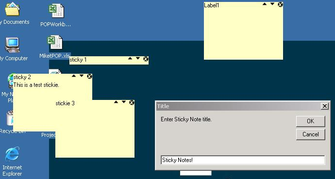



## Stickies

### Description

This is an update to code originally submitted by Michael Barnathan. I modified it so that you can use multiple sticky notes concurrently.
 
### More Info
 
Improved productivity :)

             |
---                |---
**Submitted On**   |2001-08-21 17:40:44
**By**             |[Michael Tanner](https://github.com/Planet-Source-Code/PSCIndex/blob/master/ByAuthor/michael-tanner.md)
**Level**          |Intermediate
**User Rating**    |5.0 (20 globes from 4 users)
**Compatibility**  |VB 5\.0, VB 6\.0
**Category**       |[Complete Applications](https://github.com/Planet-Source-Code/PSCIndex/blob/master/ByCategory/complete-applications__1-27.md)
**World**          |[Visual Basic](https://github.com/Planet-Source-Code/PSCIndex/blob/master/ByWorld/visual-basic.md)
**Archive File**   |[Stickies250908212001\.zip](https://github.com/Planet-Source-Code/michael-tanner-stickies__1-26472/archive/master.zip)

